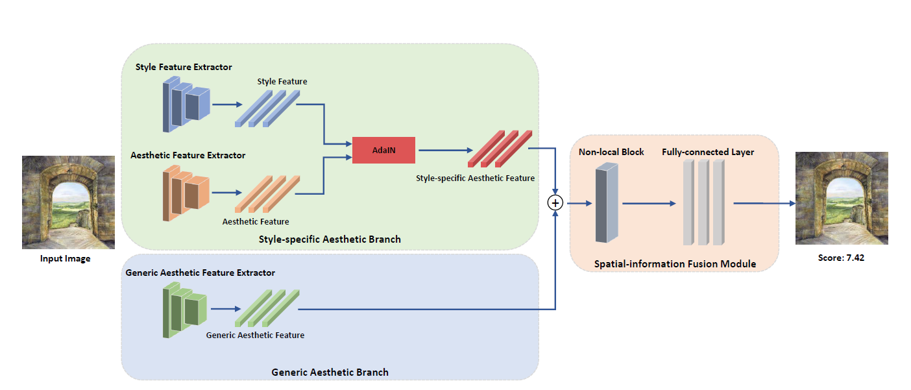
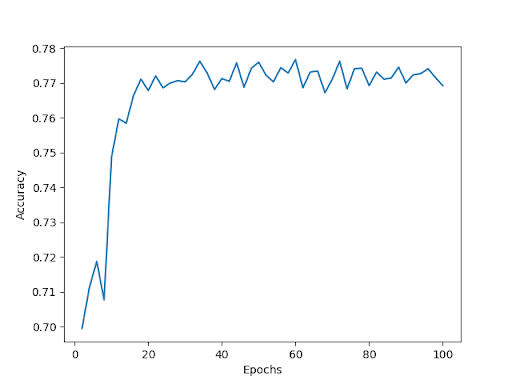
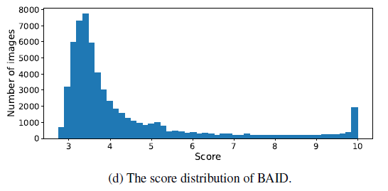

In this blog we will discuss the process for reproducing paper: Towards Artistic Image Aesthetics Assessment: a Large-scale Dataset and a New Method written in 2023 [1]. 

This work was implemented by group 79 for the Deep Learning course:

| Names       | Tasks |
| ---------- | ----- |
| Anna Kalandadze (5268915) a.g.kalandadze@student.tudelft.nl| Re-trained and re-tested the model for ablation study without GAB branch on 20 epochs. |
| Aleksandra Andrasz (5209536) A.Andrasz@student.tudelft.nl | Re-trained and re-tested the model for ablation study without SAB branch on 20 epochs. |
| Olga Bunkova (4915917) O.A.Bunkova@student.tudelft.nl|  Optimized the hyperparameters of the model using Optuna framework, re-trained the model on 10 epochs and re-tested it.|
| Rafaël Labbé (5096227) R.M.Labbe@student.tudelft.nl| Tuned the hyperparameters of the model, re-trained and re-tested it on 10 epochs and 12 trials.|

All four of us worked on setting up the environment on Google Cloud. 
Firstly, Anna and Aleksandra set up general environment and requested GPU. Then, Rafael and Olga uploaded the dataset on Google Cloud.


Resources:
* [Reproduced paper](https://arxiv.org/abs/2303.15166)
* [Author's code](https://github.com/Dreemurr-T/BAID)
* [Our code](https://github.com/aleksandra-and/Reproducing-Towards-Artistic-Image-Aesthetics-Assessment)


# Paper background
The goal of [1] is to evaluate artworks based on style-specific and generic aesthetics features. Style specific features were extracted as different styles have different aesthetics features, which cannot be assessed in the same way. To normalize the results for different styles, adaptive instance normalization was used. To extract generic aesthetics features, the generic aesthetics branch was trained using self-supervised learning, which was based on correlation between aesthetic quality and degradation editing operations (multiple image manipulations to reduce aesthetics impression). Lastly, layouts of the images were fused using non-local blocks. 

As aesthetics is subjective, the authors collected opinion-based assessment for different artworks using an open-source platform. The scores for each artwork were normalized in range [0;10], as work with two opinions cannot be assessed in the same way as work with hundred opinions. Sigmoid function was used to generate scores. 

The representation of branches used can be seen in the picture below.



  

# Reproduction study

## Methods

### Dataset
Dataset was created by the authors of the paper. It contains 60337 artworks, which have more than 360000 user opinions. Those opinions are normalized into scores in range [0,10] as described in [previous section](#paper-background).


### Pre-training:
The authors included a pre-training phase, where they trained the aesthetic feature extractor backbone in a self-supervised manner to detect and quantify distortions made to artworks. For the purpose of this reproduction, we use the pre-trained weights that the authors made available.

### Changes to code
Some changes were required to make the code run properly on our machines. For instance, loading the weights in the ```model.py``` file was done using the torch.load function, which we added the “map_location='cuda:0'” parameter to, to load it properly on devices with a single CUDA-enabled GPU. If no GPU is present, “map_location='cpu'” can be used instead to load the weights onto the CPU.

The ```download.py``` file is used to download the image dataset. Since the dataset is quite large, images may sometimes not download properly. Therefore, we changed the code to check which images are already downloaded and then download the ones that are not. In addition, we adapted the code to use proxies instead of downloading directly, since it appears the site that hosts the image dataset blocks Google Cloud, which is where we ran our model on a VM instance.

In ```data.py```, the path ‘images’ was changed into ‘downloading_script/images’, since that’s where the images are downloaded to by default when running the ```download.py``` script in the downloading_script folder. In ```test.py```, the “validation” dataset is loaded by default. This should be the ‘test’ dataset instead, which also fixes the problem of mismatching array sizes.

### Training
To train the model, we downloaded the dataset on a Google Cloud VM instance with a T4 GPU. We ran the model for 100 epochs using the hyperparameters provided by the authors.

## Experiments
In this section we describe experiments performed in order to reproduce and verify the results presented in the paper. This includes retraining the model, tuning hyper parameters and performing an ablation study.

### Retraining the model



We see the model appears to converge around 35 epochs, after which it plateaus and does not improve further.


|             Method                      | **SRCC**      | **PCC**       | **Accuracy**  |
| --------------------------------- |:-------------:|:-------------:|:-------------:|
| Results from the paper        | 0,473         | 0,467         | 76,80%        |
| Testing with authors' weights | 0,473     =    | 0,467  =       | 76,80%    =    |
| Re-trained model             | 0,4108 &darr; | 0,4169 &darr; | 76,38% &darr; |


When testing with the authors’ provided model, we get the exact same results that they provided in the paper, as can be seen in table above. However, although our retrained model appears to get a similar accuracy score, the spearman and pearson correlations are significantly lower. This makes the model perform worse then TANet [2], MLSP [3] and MPada [4], when run on the BAID dataset [1]. The lower performance may be a result of the combined effects of an unlucky draw with the randomly initialized weights of our retrained model and the stochastic nature of the training process.


### Hyperparameter tuning
We performed hyperparameter tuning using Optuna, an automated hyperparameter optimization framework, to enhance the performance of the model. This allowed us to explore the significance and impact of the parameters of the model. Optuna leverages Bayesian learning techniques, specifically Tree-structured Parzen Estimator (TPE), to refine its search based on the observed results and, therefore,  identify the most promising hyperparameter configurations.


|             Method                              | **w/o Hyperparam Tuning**      | **w Hyperparam Tuning**| 
| ------------------------------------------------|:-----------------:|:-----------------:|
| Learning rate of Adam Optimizer                 | 0.00001           | 0.0005            |
| Drop-out Probability in Predictor Layer         | 0,5               | 0,2               | 
| Activation Layer in Predictor Layer             | Relu              | LeakyRelu         | 

We refined the learning rate of the Adam optimizer, and fine-tuned the predictor layer, namely by adjusting the activation function and dropout probabilities. Due to the computational cost involved, we trained the hyperparameter tuned model for 10 epochs and compare it with a model with the original parameters trained for 10 epochs. Despite conducting only 12 trials, primarily to reduce computational burden, we observed a 2% increase in accuracy. We also observed significant increases in the spearman and pearson correlation coefficients.

| Method                | **SRCC** | **PCC** | **Accuracy** |
| --------------------- |:--------:|:-------:|:------------:|
| w/o hyperparam Tuning |  0.353   |  0.348  |    74,85%    |
| w hyperparam Tuning   |  0.426 &uarr;  |  0.383 &uarr; |    76.59%  &uarr;  |


### Ablation study
To understand the influence of the branches used in code, we decided to conduct ablation studies both on the Style Specific branch and Generic Aesthetics branch. While the original paper already presents multiple ablation studies, we decided to reproduce it to verify how branches influence the result. For this, we firstly removed the Style Specific branch, so that the model uses only the Generic Aesthetics branch. Then, we re-trained the model. We re-trained it using only 10 epochs instead of the original 100, due to the time and power limitations of our laptops, as we ran out of Google Cloud credits. To ensure that results are comparable, we also re-trained the original model for 10 epochs. Then, we followed the same procedure removing the Generic Aesthetics branch and leaving the Style Specific branch. Results are visible in the table below.

|                 Method                    |   **SRCC**    |    **PCC**    | **Accuracy**  |
| ----------------------------------- |:-------------:|:-------------:|:-------------:|
| full model    |       0.421        |      0.427         |           76,78%    |
| w\o Style-specific Aesthetic Branch |    0,198  &darr;  |      0,199   &darr; |    76,80%   &uarr; |
| w\o Generic Aesthetic Branch        | 0.448 &uarr; | 0.468 &uarr;| 77,30% &uarr;|

The results from removing the Style-specific Aesthetic Branch are consistent with what is described in the paper. Lower scores across all metrics suggest that this branch has an impact on the performance of the model. Surprisingly, removing the Generic Aesthetic Branch improved the performance of the model trained on 20 epochs. This result suggests that the Generic Aesthetic Branch is less crucial for the model's performance, consistent with authors' claims. Additionally the branch might be unnecessary given increased model complexity and no observed improvements.

## Conclusion
In this section we describe challanges we faced during reproduction of the paper, we suggest further improvements and provide general concusions from the obtained results. 

### Challenges:
**Downloading and uploading the data:** The dataset created by the authors comprises 60,337 images weighing 26.1 GB. The only method of accessing the data available to us, at the time of reproduction, was running a local script for around 10 hours. The size of the dataset also made it considerably harder to use Kaggle and Google Cloud due to uploading limits. The code and the task itself were not well adjusted for running it on a subset of the dataset, so we opted for different techniques to reduce the runtime (for example, reducing the number of epochs).

**Limited Google Cloud resources:** Due to expensive runtime or uploading the data, training and testing the model required all available Google Cloud resources. The expense mostly stems from a large dataset and a complex model. This forced us to conduct the rest of the reproducibility study only on laptops.

**Long training time:** Both on our laptops and Google Cloud, the training time was significantly slower than what the paper claimed, 24 hours instead of 6 hours. We made the decision to decrease the number of epochs, which was reflected in the obtained results.

**Minor bugs and setup problems:** Certain code lines had to be changed to accommodate our setup. Additionally, running the code was cumbersome for Mac users due to reliance on CUDA.

**Hyperparameter tuning and the assessment of their importance:** This task was challenging due to the computational resources required for the exponentially large exploration space. We opted for a technique described in the section on [Hyperparameter tuning](###hyperparameter-tuning), but we cannot be certain if it was the same strategy used by the paper's authors. Their tuning strategy is not described in the paper.


### Reproducibility improvements
The paper's reproducibility is relatively high. Open-source code and dataset are available, which allows us to verify the results. The provided code was understandable and verifiable. The adjustments we had to make to properly run the code were minor. Moreover, when we had to make changes in the code, it was clear and easy.

Still, we want to point out possible avenues of improvement:

**Easier access to the dataset**: Accessing the dataset, particularly for testing the model on a meaningful subset of the BAID dataset, proved challenging. As highlighted in the [Challanges section](###challenges), the large dataset size and limited access created obstacles in effectively training and testing the model. A more accessible and manageable dataset subset would facilitate experimentation and validation processes.
**Additional documentation of the code**: While the readme file provides a brief overview of how to run the code, we encountered difficulties in both setting up the environment and making necessary adjustments to the codebase. More comprehensive documentation with setup instructions, dependencies, and code structure would reduce barriers for people attempting to reproduce the results.
**In-depth description of hyper-parameter tuning**: Although the authors provide the hyperparameters used in their experiments, they do not elaborate on the strategy employed to determine these values. A thorough explanation of the hyperparameter tuning process, including the rationale behind parameter selection and any optimization techniques utilized, would enhance transparency and reproducibility. Understanding the methodology behind hyperparameter tuning is crucial for replicating and building upon the reported findings.
**Introduction of different accuracy measure**: through the reproduction study, the accuracy score stayed on the same level (around 76%) even though the two other metrics (SRCC and PCC) varied greatly (from 0.198 to 0.473). This is due to the method used to compute accuracy - an image is given a score of 1 if both the ground truth and prediction are either below 5 or above it. A large portion of images is scored below 5 (see the figure below) to the point where the measure seems to be irrelevant. 

 

### Conclusion

Through the reproducibility process we found that the proposed method can be a vaiable way to assess the aesthetic value of artistic images. Our reproduction does not support the claim of it being the best avaialble method. The model seems to be sensitive to small changes in hyper-parameters, initial weight initalization and removal of branches leading to inconsistant results. 


## References
[1] R. Yi, H. Tian, Z. Gu, Y.-K. Lai, and P. L. Rosin, ‘Towards Artistic Image Aesthetics Assessment: a Large-scale Dataset and a  New Method’, *arXiv [cs.CV].* 2023.

[2] Shuang Ma, Jing Liu, and Chang Wen Chen. A-Lamp: Adaptive layout-aware multi-patch deep convolutional neural network for photo aesthetic assessment. *In Proceedings of the IEEE Conference on Computer Vision and Pattern Recognition*, pages 4535–4544, 2017. 1, 3

[3] Vlad Hosu, Bastian Goldlucke, and Dietmar Saupe. Effective aesthetics prediction with multi-level spatially pooled features. *In Proceedings of the IEEE/CVF Conference on Computer Vision and Pattern Recognition*, pages 9375–9383,
2019.

[4] Kekai Sheng, Weiming Dong, Chongyang Ma, Xing Mei, Feiyue Huang, and Bao-Gang Hu. Attention-based multipatch aggregation for image aesthetic assessment. *In Proceedings of the 26th ACM International Conference on Multimedia, pages 879–886*, 2018.

